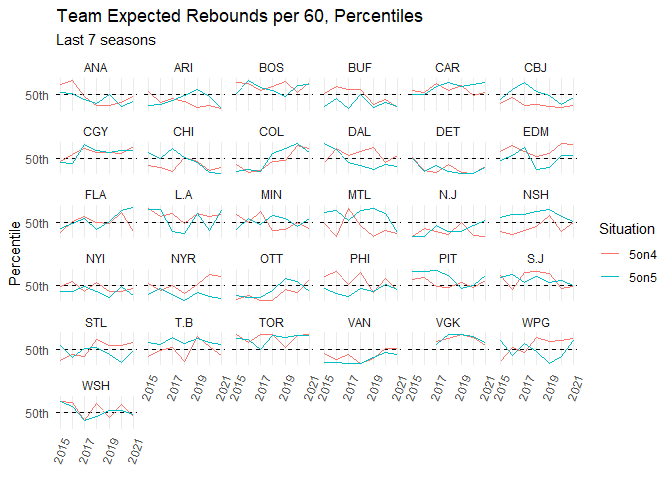
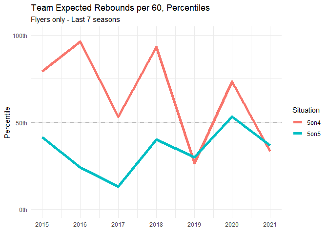
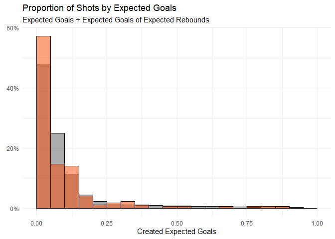
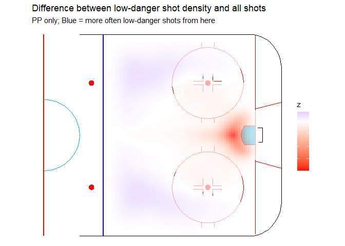
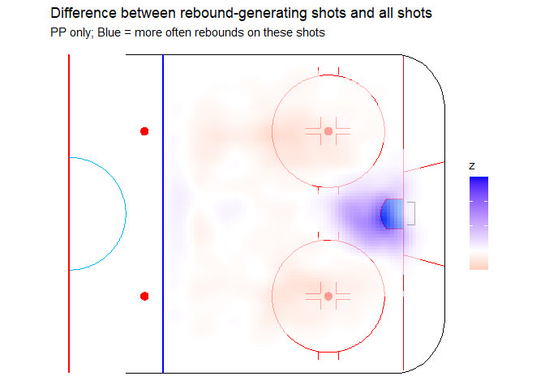
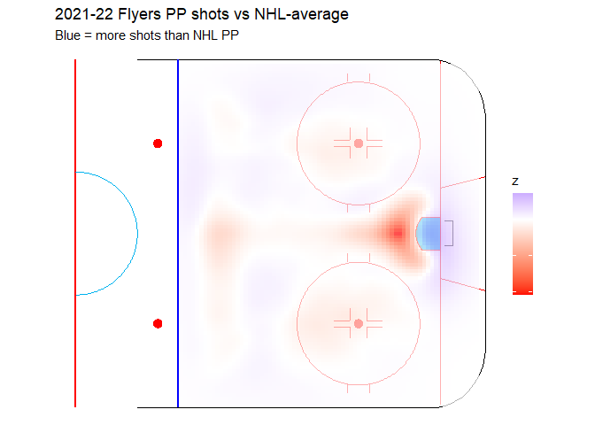
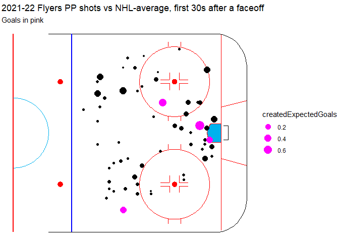

Why are the Flyers not scoring on the PP?
================
Douglas Liebe, Ph.D.
1/7/2022

> The Flyers have generated less rebounds per minute of powerplay time
> than every team but the Islanders this year.

I choose to dive into the Flyers’ powerplay here. The following is an
approximation of my thought process working through this prompt.

### Contents

[Read the data](#readdata) - read in the various MoneyPuck datasets

[Clean the data](#cleandata) - adding some QOL variables and making
helpful datasets

[Why this topic?](#choosetopic) - insight into how I decided what to dig
in to

[Why so few rebounds?](#lessrebounds) - what are some causes for fewer
created PP rebounds?

[Why has the PP been poor?](#results) - what does the Flyers’ PP look
like compared to average?

[Further directions](#explorefurther) - directions to explore from here

<br> <br>

<a id="choosetopic"></a>

#### What made this interesting?

I was looking for something hockey-related to analyze and I saw Micah’s
tweet about the [Flyers’
PP](https://twitter.com/IneffectiveMath/status/1460780351794651150?s=20).

When referring to Moneypuck.com, one noticeable data point that stood
out was the Flyers’ 3rd-lowest Goals For per 60 minutes (GF60) on the
powerplay. This combines with a 4th-worst xGoals/60 generated on the
power play. The Flyers have also generated the 3rd-least PP rebounds of
all NHL teams, as of 1/6/22. According to NaturalStatTrick.com, last
season (20-21), the Flyers created 30.28 expected Goals (xG) on the
powerplay out of 144.6 xG overall. Powerplays made up 292 of their 3421
minutes of game time last year, meaning 21% of xGoals were created in a
specific 8% of the game.

Let’s dig deeper into power play goal creation and why the Flyers’
creation has been low. To me, I think of two potential reasons: low shot
quantity and low shot quality. Are we being selective enough, or are we
being too selective on the PP?

<br>

<a id="readdata"></a>

#### Read the data

We will start by reading in the data. I want to look at team-level
season-over-season data and shot-level data for past seasons and this
year. I know I’m interested in the power play, so we will create
datasets for powerplay data now.

<br>

``` r
#turning off warnings
options(warn=-1, dplyr.summarise.inform = F)

if (!require("pacman")) install.packages("pacman",repos = "http://cran.us.r-project.org")
pacman::p_load(MASS, tidyverse, usethis, here, reshape2, scales)
pacman::p_install_gh("EFastner/icescrapR")


## download the current data from MP.com
mp_data_url_22 <- "https://peter-tanner.com/moneypuck/downloads/shots_2021.zip"

# if no shots folder already here, get it
if(!('shots_2021' %in% list.files(here::here()))) {
  # delete zip after extracting to current directory
  use_zip(mp_data_url_22, destdir = here::here(), cleanup = TRUE) 
} else {
  paste0("Already have 2021-22 shots!")
}
```

    ## [1] "Already have 2021-22 shots!"

``` r
## read data you just downloaded
shots_data_22 <- read_csv(here::here('shots_2021', 'shots_2021.csv'), show_col_types = FALSE)

## download all recent shots data
mp_data_url_all <- "https://peter-tanner.com/moneypuck/downloads/shots_2013-2020.zip"

# if no shots folder already here, get it
if(!('shots_2013-2020' %in% list.files(here::here()))) {
  # delete zip after extracting to current directory
  use_zip(mp_data_url_all, destdir = here::here(), cleanup = TRUE) 
} else {
  paste0("Already have historical shots!")
}
```

    ## [1] "Already have historical shots!"

``` r
## read data you just downloaded
shots_data_all <- read_csv(here::here('shots_2013-2020', '2013-2020.csv'), show_col_types = FALSE)


# ## How does the shooters variable line up with team player counts?
# shots_data %>% 
#   select(team, teamCode, homeTeamCode, awayTeamCode, homeSkatersOnIce, awaySkatersOnIce)


## get team level data from MP
read_csv("https://moneypuck.com/moneypuck/playerData/careers/gameByGame/all_teams.csv",
         show_col_types = FALSE) %>% 
  filter(season >= 2015) -> ## take out only since Hakstol
  team_level_data_hist


## function for finding difference in 2 kernel density estimates
## this is great for comparing shooting locations between 2 states
diff_matrix <- function(data1, data2) {
  ## must use x and y for coordinates
  # Calculate the common x and y range 
  xrng = range(c(data1$x, data2$x))
  yrng = range(c(data1$y, data2$y))
  
  # Calculate the 2d density estimate over the common range
  d1 = MASS::kde2d(data1$x, data1$y, lims=c(xrng, yrng), n=100)
  d2 = MASS::kde2d(data2$x, data2$y, lims=c(xrng, yrng), n=100)
  
  # Confirm that the grid points for each density estimate are identical
  if(identical(d1$x, d2$x) & identical(d1$y, d2$y)) {
    
    # Calculate the percent difference between the 2d density estimates
    diff12 = d1 
    diff12$z = (d2$z - d1$z)
    
    ## Melt data into long format
    # First, add row and column names (x and y grid values) to the z-value matrix
    rownames(diff12$z) = diff12$x
    colnames(diff12$z) = diff12$y
    
    # Now melt it to long format
    diff12.m =  reshape2::melt(diff12$z, id.var=rownames(diff12))
    names(diff12.m) = c("x","y","z")
    
    return(diff12.m)
  } else {
    return("grid points are not identical")
  }
  
}
```

<br>

<a id="cleandata"></a>

#### Clean the data

To clean up this data, we will convert teamCodes in the team-level data
to fix issues with multiple 3-letter acronyms. We will also subset a few
important datasets to make our lives easier down the road.

<br>

``` r
### record team acronyms in team-level
team_level_data_hist %>%
  filter(team != "SEA") %>%
  mutate(team = recode(team,
                       'SJS'='S.J',
                       "LAK" = "L.A",
                       "NJD"="N.J",
                       "TBL"="T.B")) ->
  clean_team_hist


## figure out how many people are on the ice relative to the shooter, not HOME/AWAY
## identify the 5v4 shots for PP chances specifically
shots_data_22 %>%
  mutate(
    teamSkatersOnIce = ifelse(team == "HOME",homeSkatersOnIce, awaySkatersOnIce ),
    oppSkatersOnIce = ifelse(team == "AWAY",homeSkatersOnIce, awaySkatersOnIce ),
    is5v4 = teamSkatersOnIce == 5 & oppSkatersOnIce == 4
    ) ->
  clean_shots_data_22

## make a couple useful datasets now
clean_shots_data_22 %>%
  filter(teamCode == "PHI") ->## they are the shooting team
  flyers_shots_22

clean_shots_data_22 %>%
  filter(is5v4) ->
  powerplay_shots_22

flyers_shots_22 %>%
  filter(is5v4) ->
  flyers_powerplay_shots_22

##### do similar with all shots data
shots_data_all %>%
  mutate(
    teamSkatersOnIce = ifelse(team == "HOME",homeSkatersOnIce, awaySkatersOnIce ),
    oppSkatersOnIce = ifelse(team == "AWAY",homeSkatersOnIce, awaySkatersOnIce ),
    is5v4 = teamSkatersOnIce == 5 & oppSkatersOnIce == 4
    ) %>%
  filter(is5v4) ->
  pp_shots_all
```

<br> <br>

#### What is interesting to you?

I want to first dive into rebounds and see if anything sticks out
regarding rebound generation on the PP.

<br>

``` r
## look at this data first
# team_level_data_hist %>%
#   head %>%
#   colnames()
#
# team_level_data_hist %>%
#   filter(situation == "5on5", team == "PHI", season == 2021) %>%
#   nrow()


## look at PP rebounds/60
## add some rebound-specific variables
clean_team_hist %>%
  filter(situation %in% c("5on5", "5on4")) %>%
  select(team, season, situation, iceTime, contains('rebounds')) %>%
  group_by(team, season, situation) %>%
  summarise(
    RF60 = sum(reboundsFor)/sum(iceTime), #rebounds per minute
    xRF60 = sum(xReboundsFor)/sum(iceTime) #xrebounds per minute
  ) %>%
  group_by(season, situation) %>%
  mutate(RF60_percentile = percent_rank(RF60),
         xRF60_percentile = percent_rank(xRF60)) ->
  rebound_hist_data

## using data already standardized to league percentiles, see how all teams compare
## Rebounds rate for all teams over last 7 seasons
rebound_hist_data %>%
  ggplot(aes(season, RF60_percentile, color = situation))+
  geom_hline(yintercept = 0.5, lty = 2, color = 'black')+
  geom_line()+
  facet_wrap(~team)+
  scale_y_continuous(breaks = c(0.5), labels = c("50th"), limits = c(0,1))+
  scale_x_continuous(breaks = seq(2015, 2021, 2), )+
  labs(title = "Team Rebounds per 60, Percentiles", subtitle = "Last 7 seasons",
       x = element_blank(), y = "Percentile", color= "Situation")+
  theme_minimal()+
  theme(axis.text.x = element_text(angle = 70, vjust = 0.5))
```

<!-- -->

<br>

Let’s also look at MoneyPuck’s expected rebounds metric

<br>

``` r
## expected rebounds
rebound_hist_data %>%
  ggplot(aes(season, xRF60_percentile, color = situation))+
  geom_hline(yintercept = 0.5, lty = 2, color = 'black')+
  geom_line()+
  facet_wrap(~team)+
  scale_y_continuous(breaks = c(0.5), labels = c("50th"), limits = c(0,1))+
  scale_x_continuous(breaks = seq(2015, 2021, 2), )+
  labs(title = "Team Expected Rebounds per 60, Percentiles", subtitle = "Last 7 seasons",
       x = element_blank(), y = "Percentile", color= "Situation")+
  theme_minimal()+
  theme(axis.text.x = element_text(angle = 70, vjust = 0.5))
```

<!-- -->

<br>

Now that we have those, let’s look at just the Flyers

<br>

``` r
## looking at just the Flyers
rebound_hist_data %>%
  filter(team == "PHI") %>%
  ggplot(aes(season, xRF60_percentile, color = situation))+
  geom_hline(yintercept = 0.5,size = 1, lty = 2, color = 'grey')+
  geom_line(size = 2)+
  scale_y_continuous(breaks = c(0, 0.5,1), labels = c("0th","50th", "100th"), limits = c(0,1))+
  scale_x_continuous(breaks = seq(2015, 2021, 1))+
  labs(title = "Team Expected Rebounds per 60, Percentiles", subtitle = "Flyers only - Last 7 seasons",
       x = element_blank(), y = "Percentile", color= "Situation")+
  theme_minimal()
```

<!-- -->

<br> <br>

<a id="lessrebounds"></a>

#### Less rebounds

The Flyers have been trending down in expected rebounds per 60 minutes
of PP (a stat used by MoneyPuck to predict rebounds based on the same
criteria as expected goals) over the last 7 seasons. Because rebounds
have a much higher chance to be goals (\~25% according to [Cole
Anderson](https://crowdscoutsports.com/game-theory/rebound-control/))
and shooting for rebounds can create even higher expected goals than
non-rebound shots, MoneyPuck also combines the expected goals from a
player’s shot and the expected goals from the potential rebound to
create a stat called “Created Expected Goals” (**CEG**).

*C**E**G* = *x**G**o**a**l**s*<sub>*S**h**o**t*</sub> + *x**G**o**a**l**s*<sub>*x**R**e**b**o**u**n**d**s*</sub>

Let’s look at Created Expected Goals and see if the trend on the PP for
the Flyers is evident there as well.

<br>

``` r
## look at PP CEG rates
## MP has "scoreFlurryAdjustedTotalShotCreditFor" which adds rebound credit to xG of a shot
clean_team_hist %>%
  filter(situation %in% c( "5on4")) %>%
  select(team, season, situation, iceTime, scoreFlurryAdjustedTotalShotCreditFor) %>%
  group_by(team, season, situation) %>%
  summarise(
    xCEG60 = sum(scoreFlurryAdjustedTotalShotCreditFor)/sum(iceTime)
  ) %>%
  group_by(season, situation) %>%
  mutate(xCEG60_percentile = percent_rank(xCEG60)) ->
  CEG_hist_data

## Look at Flyers percentiles in CEG over time
CEG_hist_data %>%
  filter(team == "PHI") %>%
  ggplot(aes(season, xCEG60_percentile))+
  geom_hline(yintercept = 0.5, lty = 2, color = 'grey')+
  geom_line(color = "#F74902", size = 2)+
  geom_point(color = "#F74902", size = 4)+
  scale_y_continuous(limits = c(0,1), breaks = seq(0,1, 0.5), labels = paste0(seq(0,100,50), "th")) +
  labs(title = "Team Created Expected Power Play Goals, Percentiles", subtitle = "Flyers only - Last 7 seasons",
       x = element_blank(), y = "Percentile")+
  theme_minimal()
```

<!-- -->

<br>

The decline in expected created goals suggests that Flyers’ players are
not getting better chances, which would limit rebounds by scoring more.
Rather, they are not generating shots that have high goal chances at
all. Let’s look at the percentage of shots this year on the power play
that fall into different “Danger” zones according to their chance to
become a goal or their chance to become a rebound.

One trick: MoneyPuck only provides CEG for boxscore-level data, so
deriving the created xGoals on rebounds will be done manually. Cole
Anderson’s piece on rebounds suggests that xGoals for rebounds = 25% on
average. Let’s check that first.

<br>

``` r
# ## how many rebound shots become goals?
# powerplay_shots_22 %>%
#   # colnames
#   group_by(shotRebound) %>%
#   summarise(avgGoals = mean(goal),
#             avgxGoals = mean(xGoal),
#             shots = n())

## we can check all PP shots since 2013 instead
pp_shots_all %>%
  # colnames
  group_by(shotRebound) %>%
  summarise(avgGoals = mean(goal),
            avgxGoals = mean(xGoal),
            shots = n())
```

    ## # A tibble: 2 x 4
    ##   shotRebound avgGoals avgxGoals  shots
    ##         <dbl>    <dbl>     <dbl>  <int>
    ## 1           0   0.0791    0.0732 110891
    ## 2           1   0.252     0.257    8111

<br>

Since 2013, about 25% of rebounded **power play** shots go in. More than
3x more likely than a league-average power play shot. Based on this
information, we will go with Cole’s coefficient of 25% for rebound xG on
the powerplay.

So now we can use 25% x xRebound to get an estimate for CEG. Let’s
compare the Flyers’ PP shots to the league.

<br>

``` r
## Break shots into 20 bins by danger
## 0-5% xG; 5-10%, etc.
## just 2021-21 shots for Flyers
pp_shots_all %>%
  select(teamCode, xGoal, xRebound) %>%
  mutate(createdExpectedGoals = xGoal + xRebound*0.25) %>%
  ggplot(aes(x = createdExpectedGoals))+
  geom_histogram(aes(y = stat(count) / sum(count)),
                 alpha = 0.5,breaks = seq(0,1,0.05), color = 'black') +
  geom_histogram(data = flyers_powerplay_shots_22 %>% ## use only PHI data here
      filter(teamCode == "PHI") %>%
  select(teamCode, xGoal, xRebound) %>%
  mutate(createdExpectedGoals = xGoal + xRebound*0.25),
  aes(y = stat(count) / sum(count)),
  breaks = seq(0,1,0.05),
  fill = "#F74902", alpha = 0.5, color = "black") +
  labs(title = "Proportion of Shots by Expected Goals",
       subtitle = "Expected Goals + Expected Goals of Expected Rebounds",
       y = element_blank(),
       x = "Created Expected Goals")+
  scale_y_continuous(labels = scales::percent)+
  theme_minimal()
```

<!-- -->

<br>

The Flyers are producing a lot of low danger shots on the PP. We can
check how often their shots get less than a 5% chance of being goals.

<br>

``` r
##
## What are the values for the first bin above?
pp_shots_all %>%
  select(teamCode, xGoal, xRebound) %>%
  mutate(createdExpectedGoals = xGoal + xRebound*0.25,
         danger_bins = cut(createdExpectedGoals, breaks = c(seq(0, 0.05, 0.05),1), right = F)) %>%
  group_by(danger_bins,flyers = ifelse(teamCode == "PHI", "PHI", "LEAGUE")) %>%
  count(name = 'shots') %>%
  group_by(flyers) %>%
  mutate(shots_percent = shots/sum(shots)) %>%
  ungroup() %>%
  # slice(1:10) %>% ## look at low danger chances
  pivot_wider(names_from = flyers, values_from = c(shots_percent, shots)) %>%
  mutate(across(starts_with('shots_percent'), scales::percent))
```

    ## # A tibble: 2 x 5
    ##   danger_bins shots_percent_LEAGUE shots_percent_PHI shots_LEAGUE shots_PHI
    ##   <fct>       <chr>                <chr>                    <int>     <int>
    ## 1 [0,0.05)    48.1%                46.5%                    55165      1990
    ## 2 [0.05,1)    51.9%                53.5%                    59560      2287

<br>

This appears to be a problem. Some 57% of Flyers’ PP shots are
generating &lt;5% chance to score, even after accounting for potential
rebound chances. This is **12% more** than the rest of the league this
year so far. So shot quality is definitely an issue. Is shot quantity?
Flyers rank 4th-worst in SF/60 on the PP, according to
naturalstattrick.com. So it appears both shot quantity and quality are
affecting the Flyers’ chances at scoring goals.

<br> <br>

<a id="results"></a>

#### What might be causing results?

Let’s look at what these low-danger scoring chances look like. I will
make a density chart of where these shots come from, then compare to a
shot-chart of all shots.

<br>

``` r
## make a density matrix of low danger pp shots

## make the adjusted coords be standard
## add CEG metric
pp_shots_all %>%
  mutate(createdExpectedGoals = xGoal + xRebound*0.25) %>%
  rename(x = xCordAdjusted, y = yCordAdjusted) ->
  pp_shots_loc

## create dataset of only low danger shots
pp_shots_loc %>%
  filter(createdExpectedGoals < 0.05) ->
  low_danger_shots_loc

# ## test plot of these shots to make sure they are in correct orientation
# icescrapr::viz_draw_rink() +
#   lims(x = c(0,100))+
#   geom_density2d_filled(data = low_danger_shots_loc %>%
#                    filter(teamCode == 'PHI'),
#                  aes(x,y), alpha = 0.4)+
#   guides(fill = "none")


## function takes kernel density estimate for a surface, subtracts out the density of another surface
## so I want to see low danger shots locations - all shots locations
dens_diff <- diff_matrix(data1 = pp_shots_loc, data2 = low_danger_shots_loc)

# ## look at the distribution of z values (densities)
# dens_diff %>%
#   ggplot() +
#   geom_density(aes(z))+
#   lims(x = c(-0.0001,0.0001))

## now plot the difference in shot density for low- vs all-danger shots
## filter out values really close to 0 (no difference)
icescrapr::viz_draw_rink() +
  lims(x = c(0,100))+
  geom_tile(data = dens_diff %>%
              filter(
                abs(z) > 0.00001, ## no real change in density
                x> 25 ## stuff outside the blue line
              ), aes(x, y, z=z, fill=z), alpha = 0.7)+
  scale_fill_gradient2(low="red",high="blue", midpoint=0) +
  labs(title = "Difference between low-danger shot density and all shots",
       subtitle = "PP only; Blue = more often low-danger shots from here")+
  theme(legend.text = element_blank())
```

<!-- -->

<br>

This makes sense. Shots in close make more goals. Let’s look at where
shots come from that make more rebounds.

<br>

``` r
# what about rebounds alone?
pp_shots_loc %>%
  filter(shotGeneratedRebound == 1) ->
  shots_loc_reb

dens_diff_reb <- diff_matrix(data1 = pp_shots_loc, data2 = shots_loc_reb)

## now plot the difference in shot density for reb vs No rebound
## filter out values really close to 0 (no difference)
icescrapr::viz_draw_rink() +
  lims(x = c(0,100))+
  geom_tile(data = dens_diff_reb %>%
              filter(
                abs(z) > 0.00001, ## no real change in density
                x> 25 ## stuff outside the blue line
              ), aes(x, y, z=z, fill=z), alpha = 0.7)+
  scale_fill_gradient2(low="red",high="blue", midpoint=0) +
  labs(title = "Difference between rebound-generating shots and all shots",
       subtitle = "PP only; Blue = more often rebounds on these shots")+
  theme(legend.text = element_blank())
```

<!-- -->

<br>

So we can see that low danger shots come from out-wide, which makes
sense. This combined with the fact that rebounds are much more likely on
shots in-close, we are beginning to see a potential pattern: The Flyers
aren’t getting chances in close, which, in turn, doesn’t generate as
many rebounds. We can check this by looking at Flyers 21-22 PP shot
locations.

<br>

``` r
# flyers PP this year only
flyers_powerplay_shots_22 %>%
  rename(x = xCordAdjusted, y = yCordAdjusted) ->
  flyers_pp_shots_22_clean

## Flyers 21-22 PP shots - Average NHL PP shots
dens_diff_phi <- diff_matrix(data1 = pp_shots_loc, data2 = flyers_pp_shots_22_clean)

## Plot
icescrapr::viz_draw_rink() +
  lims(x = c(0,100))+
  geom_tile(data = dens_diff_phi %>%
              filter(
                # abs(z) > 0.00001, ## no real change in density
                x> 25 ## stuff outside the blue line
              ), aes(x, y, z=z, fill=z), alpha = 0.7)+
  scale_fill_gradient2(low="red",high="blue", midpoint=0) +
  labs(title = "2021-22 Flyers PP shots vs NHL-average",
       subtitle = "Blue = more shots than NHL PP")+
  theme(legend.text = element_blank())
```

<!-- -->

<br>

It is clear in the above graph that the Flyers are not generating
chances in front of the net, relative to the league-average. We also
know they shoot less-often on average too.

One other avenue of interest to me is the first 30 seconds of a
powerplay, which is often the most scripted: a team has their PP1 out
more often, the possession always starts with a faceoff in the offensive
zone. This introduces a type of bias that would need to be corrected for
in a more substantial analysis: faceoff wins and controlled zone entries
on zone clear. Actually **having the puck** during the first 30s of a PP
would make a huge difference, but that will be for another day.

Let’s look at where the Flyers’ shots have been during this time period.

**NOTE** - I found inconsistencies in the powerplay goal data in regards
to whether the time remaining in the penalty at the time of the shot
were reported or simply listed as “0”. Because of this I had to pivot
and look at shots generated in the first 30s following a faceoff. The
subsample is bigger, but includes similar situations. A limitation would
be shots after a faceoff but very close to the end of the penalty. With
more time, I could go back and contextualize the goals based on previous
events and determine time remaining in the respective powerplays.

<br>

``` r
## how do shots look in the first 30 seconds of a power play?

# ## How are penalties reported in the MP dataset?
# pp_shots_loc %>%
#   ggplot() +
#   # geom_histogram(aes(homePenalty1TimeLeft + awayPenalty1TimeLeft))+
#   geom_histogram(aes(homePenalty1Length + awayPenalty1Length))

## since we already know pp_shots_loc has only 5v4 power play shots for,
## we can filter by the time left in any 2-minute penalty to get early PP chances
pp_shots_loc %>%
  mutate(createdExpectedGoals = xGoal + xRebound*0.25) %>%
  filter(homePenalty1Length == 120 | awayPenalty1Length == 120,
         homePenalty1TimeLeft > 90 | awayPenalty1TimeLeft > 90) ->
  first_30_pp_shots

## do the same thing with Flyers only
flyers_pp_shots_22_clean %>%
  mutate(createdExpectedGoals = xGoal + xRebound*0.25) %>%
  # filter(homePenalty1Length == 120 | awayPenalty1Length == 120,
  #        homePenalty1TimeLeft > 90 | awayPenalty1TimeLeft > 90) ->
  filter(timeSinceFaceoff < 30) ->
  phi_first_30_pp

## since so few shots, no need for density plot
## plot shot locations
icescrapr::viz_draw_rink() +
  lims(x = c(0,100))+
  geom_point(
    data = phi_first_30_pp %>%
              filter(
                goal == 0,
                x> 25 ## stuff outside the blue line
              ), aes(x, y, size = createdExpectedGoals)
  )+
  geom_point(data = phi_first_30_pp %>%
               filter(
                 goal == 1,
                 x> 25 ## stuff outside the blue line
               ), aes(x, y, size = createdExpectedGoals), color = '#ff00ff',
  )+
  labs(title = "2021-22 Flyers PP shots vs NHL-average, first 30s after a faceoff",
       subtitle = "Goals in pink")
```

<!-- -->

<br>

What does a team like Toronto look like? They have the 2nd-greatest
xGF/60 and league-best CF/60 on the 5v4 PP.

<br>

``` r
### what does TOR look like?
powerplay_shots_22 %>%
  mutate(createdExpectedGoals = xGoal + xRebound*0.25) %>%
  rename(x = xCordAdjusted, y = yCordAdjusted) %>%
  # filter(homePenalty1Length == 120 | awayPenalty1Length == 120,
  #        homePenalty1TimeLeft > 90 | awayPenalty1TimeLeft > 90,
  #        teamCode == "TOR") ->
  ## adjusting to only 30s after a faceoff
  filter(teamCode == "TOR", timeSinceFaceoff < 30) ->
  tor_first_30_pp_21

# plot
icescrapr::viz_draw_rink() +
  lims(x = c(0,100))+
  geom_point(
    data = tor_first_30_pp_21 %>%
              filter(
                x> 25 ## stuff outside the blue line
              ), aes(x, y, size = createdExpectedGoals)
  )+
  geom_point(data = tor_first_30_pp_21 %>%
               filter(
                 goal == 1,
                 x> 25 ## stuff outside the blue line
               ), aes(x, y, size = createdExpectedGoals), color = '#ff00ff',
  )+
  labs(title = "2021-22 Toronto PP shots vs NHL-average, first 30s after a faceoff",
       subtitle = "Goals in pink")
```

<!-- -->

``` r
# # Who is taking Flyers' early PP shots with low xG?
# phi_first_30_pp %>%
#   mutate(low_danger = createdExpectedGoals < 0.05) %>%
#   group_by(low_danger) %>%
#   count(shooterName) %>%
#   group_by(shooterName) %>%
#   mutate(pct = n/sum(n)) %>%
#   arrange(desc(n))
#
# ### what % of shots come in the first 30s of powerplays, and how many xG are created?
# powerplay_shots_22 %>%
#   mutate(createdExpectedGoals = xGoal + xRebound*0.25) %>%
#   mutate(first_30 = (homePenalty1Length == 120 | awayPenalty1Length == 120) &
#          (homePenalty1TimeLeft > 90 | awayPenalty1TimeLeft > 90)) %>%
#   group_by(teamCode) %>%
#   summarise(early_pp_shot_percent = mean(first_30),
#             xG_early_pp_percent = mean(createdExpectedGoals*first_30)) %>%
#   arrange(xG_early_pp_percent)
```

<br>

<a id="explorefurther"></a>

#### What would I explore further?

More context always helps. As we’ve seen, rebounds are a tricky thing.
In the attempt to generate rebounds, the puck most often goes in the
area where rebounds occur. This can be a “chicken or the egg” situation.
Evaluating shot selection requires nuance. An example of what this
analysis misses would be a shot where the other attackers are not in a
position to get a rebound. This could be distance of those skaters to
the net, or the positioning of the defenders to prevent those rebound
chances. Shooters being able to identify good times to shoot creates
more value than shots alone.

By using tracking data, we could better contextualize the situations in
which shots were taken (or not), and try to find the best situations to
generate potential goals. When going through the data to find poor PP
shots to use an examples, I noticed that power play goals are sometimes
recorded as occurring with no time left on the penalty, and other times
the penalty time remaining is correct at the time of the shot/goal. This
season, 5 of the Flyers’ PP goals have been labelled as occuring with
penalty time remaining, and 7 have been labelled as being scored with 0
seconds of penalty time remaining. This inconsistency points to the
value in in-house tracking data, allowing the Flyers to have better
control over their own data.

<br> <br>
<!-- Here is a clip from a recent game where a shot was taken 19 seconds into the power play. [Youtube link](https://youtu.be/rUSiuVg78y8?t=53).   -->
